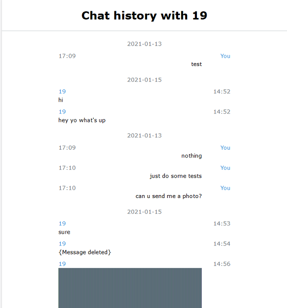

# Whatsapp-Chat-Exporter
A Whatsapp database parser that will give you the history of your Whatsapp conversation in HTML and JSON  
**If you plan to uninstall WhatsApp or delete your WhatsApp account, please make a backup of your WhatsApp database. You may want to use this exporter again on the same database in the future as the exporter develops**

# Usage
First, clone this repo, and copy all py and html files to a working directory if you want to do so.
```shell
git clone https://github.com/KnugiHK/Whatsapp-Chat-Exporter.git
```
Then, ready your WhatsApp database, place them in the root of working directory.
* For Android, it is called msgstore.db. If you want name of your contacts, get the contact database, which is called wa.db.
* For iPhone, it is called 7c7fba66680ef796b916b067077cc246adacf01d (YES, a hash).

Next, ready your media folder, place it in the root of working directory.
* For Android, copy the WhatsApp directory from your phone directly.
* For iPhone, run the extract_iphone_media.py, and you will get a folder called Message. Please note that, this script does not support encrypted backup.
```
python extract_iphone_media.py "C:\Users\[Username]\AppData\Roaming\Apple Computer\MobileSync\Backup\[device id]"
```
And now, you should have something like this:


Last, run the script regarding the type of phone.
```
python extract.py & :: Android
python extract_iphone.py & :: iPhone
```
And you will get these:
#### Private Message


#### Group Message


# Encrypted iPhone Backup
To do

# To do
1. Convert ```\r\n``` to ```<br>```
2. Reply in iPhone
3. The CSS for metadata (e.g. {Message Deleted})
4. Handle encrypted iPhone Backup

# Copyright
This is a MIT licensed project.

The Telegram Desktop's export is the reference for whatsapp.html in this repo
