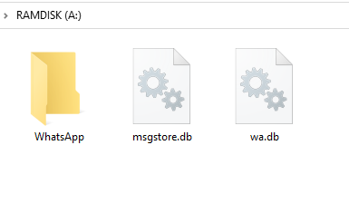
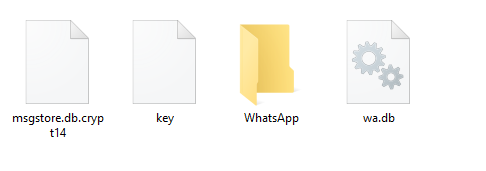
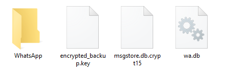
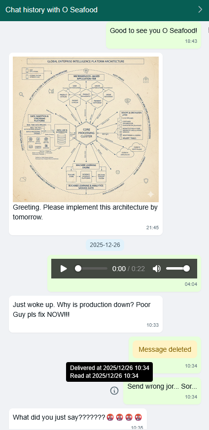
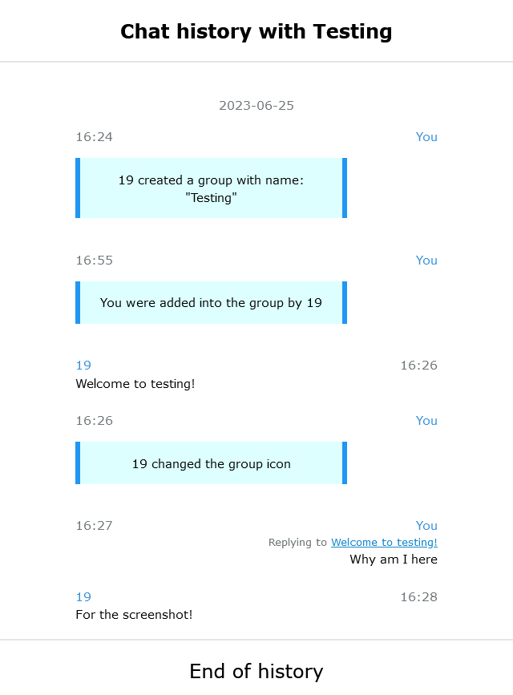

# Whatsapp-Chat-Exporter
[](https://pypi.org/project/whatsapp-chat-exporter/)

[](https://pypi.org/project/Whatsapp-Chat-Exporter/)

A customizable Android and iPhone Whatsapp database parser that will give you the history of your Whatsapp conversations in HTML and JSON. Inspired by [Telegram Chat Export Tool](https://telegram.org/blog/export-and-more).  
> [!TIP]
> If you plan to uninstall WhatsApp or delete your WhatsApp account, please make a backup of your WhatsApp database. You may want to use this exporter again on the same database in the future as the exporter develops.

If you would like to support this project, all you need to do is to contribute or share this project! If you think otherwise and want to make a donation, please refer to the [Donation Guide](https://blog.knugi.com/DONATE.html).

# Usage

> [!NOTE]
> Usage in README may be removed in the future. Check the usage in [Wiki](https://github.com/KnugiHK/Whatsapp-Chat-Exporter/wiki)
> 
> If you want to use the old release (< 0.5) of the exporter, please follow the [old usage guide](https://github.com/KnugiHK/Whatsapp-Chat-Exporter/wiki/Old-Usage#usage).

First, install the exporter by:
```shell
pip install whatsapp-chat-exporter
pip install whatsapp-chat-exporter[android_backup]  :; # Optional, if you want it to support decrypting Android WhatsApp backup.
```
Then, create a working directory in somewhere you want
```shell
mkdir working_wts
cd working_wts
```
## Working with Android
### Unencrypted WhatsApp database
Extract the WhatsApp database with whatever means, one possible means is to use the [WhatsApp-Key-DB-Extractor](https://github.com/KnugiHK/WhatsApp-Key-DB-Extractor)

After you obtain your WhatsApp database, copy the WhatsApp database and media folder to the working directory. The database is called msgstore.db. If you also want the name of your contacts, get the contact database, which is called wa.db. And copy the WhatsApp (Media) directory from your phone directly.

And now, you should have something like this in the working directory.


#### Extracting
Simply invoke the following command from shell.
```sh
wtsexporter -a
```
#### Enriching Contact from vCard
Usually, the default WhatsApp contact database extracted from your phone will contains the contact names and the exporter will use it to map your chats. However, some reported cases showed that the database could has never been populated. 
In this case, you can export your contacts to a vCard file from your phone or a cloud provider like Google Contacts. Then, install the necessary dependency and run the following command from the shell:
```sh
pip install whatsapp-chat-exporter["vcards"]
wtsexporter -a --enrich-from-vcard contacts.vcf --default-country-code 852
```

### Encrypted Android WhatsApp Backup
In order to support the decryption, install pycryptodome if it is not installed
```sh
pip install pycryptodome # Or 
pip install whatsapp-chat-exporter["android_backup"] # install along with this software
```

> [!TIP]
> Crypt15 is now the easiest way to decrypt a backup. If you have the 32 bytes hex key generated when you enable End-to-End encrypted backup, you can use it to decrypt the backup. If you do not have the 32 bytes hex key, you can still use the key file extracted just like extacting key file for Crypt12 and Crypt14 to decrypt the backup.

#### Crypt12 or Crypt14
You will need the decryption key file from your phone. If you have root access, you can find it as `/data/data/com.whatsapp/files/key`. Otherwise, if you used WhatsApp-Key-DB-Extractor before, it will appear in the WhatsApp backup directory as `WhatsApp/Databases/.nomedia`.

Place the decryption key file (key) and the encrypted WhatsApp Backup (msgstore.db.crypt14) in the working directory. If you also want the name of your contacts, get the contact database, which is called wa.db. And copy the WhatsApp (Media) directory from your phone directly.

And now, you should have something like this in the working directory.


#### Extracting
Simply invoke the following command from shell.
```sh
wtsexporter -a -k key -b msgstore.db.crypt14
```

#### Crypt15 (End-to-End Encrypted Backup)
To support Crypt15 backup, install javaobj-py3 if it is not installed
```sh
pip install javaobj-py3 # Or 
pip install whatsapp-chat-exporter["crypt15"] # install along with this software
```
Place the encrypted WhatsApp Backup (msgstore.db.crypt15) in the working directory. If you also want the name of your contacts, get the contact database, which is called wa.db. And copy the WhatsApp (Media) directory from your phone directly.  
If you do not have the 32 bytes hex key (64 hexdigits), place the decryption key file (encrypted_backup.key) extracted from Android. If you gave the 32 bytes hex key, simply put the key in the shell.

Now, you should have something like this in the working directory (if you do not have 32 bytes hex key).


##### Extracting
If you do not have 32 bytes hex key but have the key file available, simply invoke the following command from shell.
```sh
wtsexporter -a -k encrypted_backup.key -b msgstore.db.crypt15
```
If you have the 32 bytes hex key, simply put the hex key in the -k option and invoke the command from shell like this:
```sh
wtsexporter -a -k 432435053b5204b08e5c3823423399aa30ff061435ab89bc4e6713969cdaa5a8 -b msgstore.db.crypt15
```

## Working with iOS/iPadOS (iPhone or iPad)
Do an iPhone/iPad Backup with iTunes/Finder first.
* iPhone backup on Mac: https://support.apple.com/HT211229
* iPhone backup on Windows: https://support.apple.com/HT212156
* iPad backup: https://support.apple.com/guide/ipad/ipad9a74df05xx/ipados
### Encrypted iOS/iPadOS Backup
> [!NOTE]
> If you are working on unencrypted iOS/iPadOS backup, skip this.

If you want to work on an encrypted iOS/iPadOS Backup, you should install iphone_backup_decrypt from [KnugiHK/iphone_backup_decrypt](https://github.com/KnugiHK/iphone_backup_decrypt) before you run the extract_iphone_media.py.
```sh
pip install git+https://github.com/KnugiHK/iphone_backup_decrypt
```
### Extracting
Simply invoke the following command from shell, remember to replace the username and device id correspondingly in the command.
#### Windows
```sh
wtsexporter -i -b "C:\Users\[Username]\AppData\Roaming\Apple Computer\MobileSync\Backup\[device id]"
```
#### Mac
```sh
wtsexporter -i -b ~/Library/Application\ Support/MobileSync/Backup/[device id]
```

## Results
After extracting, you will get these:
#### Private Message


#### Group Message


## More options
Invoke the wtsexporter with --help option will show you all options available.
```sh
> wtsexporter --help
usage: wtsexporter [-h] [-a] [-i] [-e EXPORTED] [-w WA] [-m MEDIA] [-b BACKUP] [-o OUTPUT] [-j [JSON]] [--avoid-encoding-json] [--pretty-print-json [PRETTY_PRINT_JSON]] [-d DB] [-k KEY] [-t TEMPLATE] [-s]
                   [-c] [--offline OFFLINE] [--size [SIZE]] [--no-html] [--check-update] [--assume-first-as-me] [--no-avatar] [--import] [--business] [--wab WAB] [--time-offset {-12 to 14}] [--date DATE]
                   [--date-format FORMAT] [--include [phone number ...]] [--exclude [phone number ...]] [--dont-filter-empty] [--per-chat] [--create-separated-media] [--decrypt-chunk-size DECRYPT_CHUNK_SIZE]
                   [--enrich-from-vcards ENRICH_FROM_VCARDS] [--default-country-code DEFAULT_CONTRY_CODE] [--txt [TEXT_FORMAT]]

A customizable Android and iOS/iPadOS WhatsApp database parser that will give you the history of your WhatsApp conversations in HTML and JSON. Android Backup Crypt12, Crypt14 and Crypt15 supported.

options:
  -h, --help            show this help message and exit
  -a, --android         Define the target as Android
  -i, --ios, --iphone   Define the target as iPhone/iPad
  -e EXPORTED, --exported EXPORTED
                        Define the target as exported chat file and specify the path to the file
  -w WA, --wa WA        Path to contact database (default: wa.db/ContactsV2.sqlite)
  -m MEDIA, --media MEDIA
                        Path to WhatsApp media folder (default: WhatsApp)
  -b BACKUP, --backup BACKUP
                        Path to Android (must be used together with -k)/iOS WhatsApp backup
  -o OUTPUT, --output OUTPUT
                        Output to specific directory (default: result)
  -j [JSON], --json [JSON]
                        Save the result to a single JSON file (default if present: result.json)
  --avoid-encoding-json
                        Don't encode non-ascii characters in the output JSON files
  --pretty-print-json [PRETTY_PRINT_JSON]
                        Pretty print the output JSON.
  -d DB, --db DB        Path to database file (default: msgstore.db/7c7fba66680ef796b916b067077cc246adacf01d)
  -k KEY, --key KEY     Path to key file
  -t TEMPLATE, --template TEMPLATE
                        Path to custom HTML template
  -s, --showkey         Show the HEX key used to decrypt the database
  -c, --move-media      Move the media directory to output directory if the flag is set, otherwise copy it
  --offline OFFLINE     Relative path to offline static files
  --size [SIZE], --output-size [SIZE], --split [SIZE]
                        Maximum (rough) size of a single output file in bytes, 0 for auto
  --no-html             Do not output html files
  --check-update        Check for updates (require Internet access)
  --assume-first-as-me  Assume the first message in a chat as sent by me (must be used together with -e)
  --no-avatar           Do not render avatar in HTML output
  --import              Import JSON file and convert to HTML output
  --business            Use Whatsapp Business default files (iOS only)
  --wab WAB, --wa-backup WAB
                        Path to contact database in crypt15 format
  --time-offset {-12 to 14}
                        Offset in hours (-12 to 14) for time displayed in the output
  --date DATE           The date filter in specific format (inclusive)
  --date-format FORMAT  The date format for the date filter
  --include [phone number ...]
                        Include chats that match the supplied phone number
  --exclude [phone number ...]
                        Exclude chats that match the supplied phone number
  --dont-filter-empty   By default, the exporter will not render chats with no valid message. Setting this flag will cause the exporter to render those.
  --per-chat            Output the JSON file per chat
  --create-separated-media
                        Create a copy of the media seperated per chat in <MEDIA>/separated/ directory
  --decrypt-chunk-size DECRYPT_CHUNK_SIZE
                        Specify the chunk size for decrypting iOS backup, which may affect the decryption speed.
  --enrich-from-vcards ENRICH_FROM_VCARDS
                        Path to an exported vcf file from Google contacts export. Add names missing from WhatsApp's default database
  --default-country-code DEFAULT_CONTRY_CODE
                        Use with --enrich-from-vcards. When numbers in the vcf file does not have a country code, this will be used. 1 is for US, 66 for Thailand etc. Most likely use the number of your own
                        country
  --txt [TEXT_FORMAT]   Export chats in text format similar to what WhatsApp officially provided (default if present: result/)

WhatsApp Chat Exporter: 0.10.5 Licensed with MIT. See https://wts.knugi.dev/docs?dest=osl for all open source licenses.
```

# To do
See [issues](https://github.com/KnugiHK/Whatsapp-Chat-Exporter/issues).

# Copyright
This is a MIT licensed project.

The Telegram Desktop's export is the reference for whatsapp.html in this repo.

`bplist.py` was released by Vladimir "Farcaller" Pouzanov under MIT license.

Please also refer to any files prefixed with `LICENSE` to obtain copies of the various licenses.

WhatsApp Chat Exporter is not affiliated, associated, authorized, endorsed by, or in any way officially connected with the WhatsApp LLC, or any of its subsidiaries or its affiliates. The official WhatsApp LLC website can be found at https://www.whatsapp.com/.
